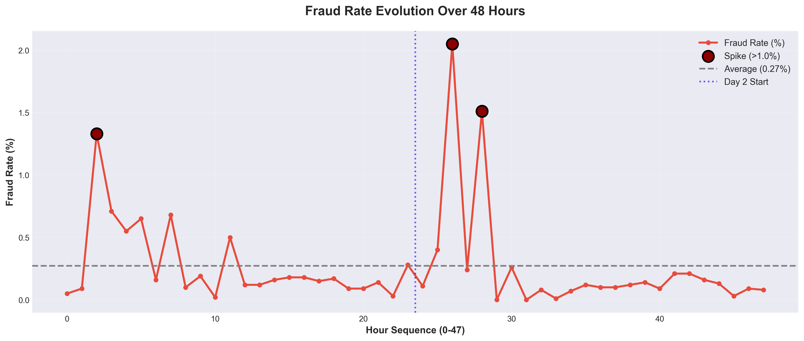
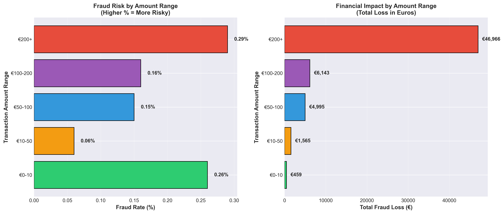

# 💳 Credit Card Fraud Detection - SQL Analysis


## 📊 Project Overview

**Business Problem:** Credit card fraud costs financial institutions billions annually. Early detection and pattern identification are critical for loss prevention.

**Solution:** This project analyzes 284,807 credit card transactions to identify fraud patterns, high-risk periods, and vulnerable transaction amounts using advanced SQL techniques (CTEs, Window Functions, JOINs).

**Key Technologies:** MySQL, Python (Pandas, Matplotlib, Seaborn), SQL

---

## 🎯 Key Findings

### 💰 Financial Impact
- **Total fraud cases:** 492 (0.17% of transactions)
- **Total fraud loss:** €89,721
- **Highest single fraud:** €2,125.87

### ⏰ Temporal Patterns
- **Peak fraud hours:** 2-4 AM (5-10x higher risk)
- **Business hour vulnerability:** 11 AM (high volume + fraud)
- **Day-over-day change:** 25% decrease from Day 0 to Day 1

### 💸 Amount-Based Risk
- **Highest risk range:** €0-10 (0.26% fraud rate) - card testing
- **Highest financial impact:** €200+ (€46,966 lost, 0.29% rate)
- **Safest range:** €10-50 (0.06% fraud rate)

### 🎯 Pareto Principle Validated
- **Top 20 frauds (4% of cases)** account for **37% of total losses**

---

## 📈 Data Visualizations

### 1. Fraud Rate Timeline (48 Hours)



**Insights:**
- 7 spike alerts detected across 48 hours
- Consistent spikes at 2 AM and 11 AM on both days
- Night hours show significantly elevated fraud rates

---

### 2. Fraud Analysis by Transaction Amount



**Insights:**
- Micro transactions (€0-10) have highest fraud rate → card testing behavior
- Large transactions (€200+) cause greatest financial damage
- Mid-range (€10-50) is safest zone

---

## 🗂️ Project Structure
```
credit-card-fraud-detection/
├── .gitignore                        
├── README.md                        
├── requirements.txt                  
├── sql/
│   └── fraud_detection.sql          
├── visualizations/
│   ├── create_visualizations.py     
│   └── images/
│       ├── fraud_rate_timeline.png
│       └── fraud_by_amount.png
└── data/
    └── .gitkeep 
```

---

## 🛠️ Technical Implementation

### SQL Techniques Used

#### 1️⃣ **Common Table Expressions (CTEs)**
Multi-level CTEs for complex aggregations and data transformation.
```sql
WITH hourly_stats AS (
    SELECT 
        hour_of_day,
        COUNT(*) AS total_transactions,
        SUM(is_fraud) AS total_frauds,
        ROUND((SUM(is_fraud) / COUNT(*)) * 100, 2) AS fraud_rate_pct
    FROM transactions
    GROUP BY hour_of_day
)
SELECT * FROM hourly_stats WHERE fraud_rate_pct > 0.20;
```

---

#### 2️⃣ **Window Functions**
Ranking, moving averages, and cumulative calculations.
```sql
WITH ranked_frauds AS (
    SELECT 
        transaction_id,
        amount,
        ROW_NUMBER() OVER (ORDER BY amount DESC) AS fraud_rank,
        SUM(amount) OVER (ORDER BY amount DESC) AS cumulative_loss
    FROM transactions
    WHERE is_fraud = 1
)
SELECT * FROM ranked_frauds WHERE fraud_rank <= 20;
```

---

#### 3️⃣ **Advanced JOINs & Aggregations**
LEFT JOINs to ensure complete data coverage and complex CASE statements for categorization.
```sql
WITH amount_categories AS (
    SELECT 
        CASE 
            WHEN amount < 10 THEN '€0-10'
            WHEN amount < 50 THEN '€10-50'
            ELSE '€50+'
        END AS amount_range,
        is_fraud,
        amount
    FROM transactions
)
SELECT 
    amount_range,
    COUNT(*) AS total_transactions,
    ROUND((SUM(is_fraud) / COUNT(*)) * 100, 2) AS fraud_rate_pct
FROM amount_categories
GROUP BY amount_range;
```

---

## 📊 Query Breakdown

### Query 1: General Fraud Statistics
- Overview of fraud scale and impact
- Basic metrics: fraud rate, total loss, transaction volume

### Query 2: Fraud by Hour of Day
- Temporal analysis using CTEs
- Identification of high-risk periods

### Query 3: Fraud by Amount Range
- Multiple CTEs for categorization
- Risk vs. financial impact analysis

### Query 4: Top 20 Frauds Ranking
- Window functions (ROW_NUMBER, cumulative %)
- Priority investigation targets

### Query 5: Temporal Trends (48h)
- LAG functions for day-over-day comparison
- Moving averages (3-hour window)
- Anomaly detection (spike alerts)

---

## 💡 Business Recommendations

### Immediate Actions
✅ **Deploy heightened monitoring during 2-4 AM** (highest fraud rate)  
✅ **Implement velocity rules:** Flag >3 micro-transactions (<€10) within 1 hour  
✅ **Prioritize investigation of TOP 20 cases** (37% recovery potential)  

### Strategic Initiatives
✅ **Adjust transaction limits dynamically** based on time of day  
✅ **Require 3D Secure authentication** for transactions >€200  
✅ **Create specialized fraud team shift** for overnight monitoring  
✅ **Investigate Day 1 improvements** (25% fraud reduction) for replication  

### Long-term Optimization
✅ **Build predictive ML model** using identified patterns  
✅ **Implement real-time anomaly detection** using moving average baselines  
✅ **Develop customer education program** on micro-transaction fraud  

---

## 🚀 How to Run This Project

### Prerequisites
- MySQL 8.0+
- Python 3.8+
- Libraries: pandas, matplotlib, seaborn, sqlalchemy, pymysql

### Setup Instructions

1. **Clone the repository**
```bash
git clone https://github.com/your-username/credit-card-fraud-detection.git
cd credit-card-fraud-detection
```

2. **Download dataset**
- Source: [Kaggle - Credit Card Fraud Detection](https://www.kaggle.com/datasets/mlg-ulb/creditcardfraud)
- Place `creditcard.csv` in `data/` folder

3. **Import data to MySQL**
```bash
# Create database
mysql -u root -p -e "CREATE DATABASE fraud_detection;"

# Import data (method varies by OS)
# See import_data.py for automated script
```

4. **Run SQL queries**
```bash
mysql -u root -p fraud_detection < sql/fraud_detection.sql
```

5. **Generate visualizations**
```bash
pip install -r requirements.txt
python visualizations/create_visualizations.py
```

---

## 📚 Dataset Information

**Source:** [Kaggle - Credit Card Fraud Detection](https://www.kaggle.com/datasets/mlg-ulb/creditcardfraud)

**Description:**
- 284,807 transactions over 48 hours (September 2013)
- 492 frauds (0.17% of transactions)
- Features transformed via PCA for confidentiality
- Real transaction amounts in Euros

**Columns:**
- `Time`: Seconds since first transaction
- `V1-V28`: PCA-transformed features
- `Amount`: Transaction amount (EUR)
- `Class`: 0 = Legitimate, 1 = Fraud

---

## 🎓 Skills Demonstrated

### SQL
✅ Complex CTEs (Common Table Expressions)  
✅ Window Functions (ROW_NUMBER, LAG, AVG OVER)  
✅ Advanced JOINs (LEFT JOIN with multiple conditions)  
✅ Aggregations & GROUP BY with HAVING  
✅ CASE statements for categorization  
✅ Query optimization for large datasets  

### Python
✅ Data extraction with SQLAlchemy  
✅ Data visualization (Matplotlib, Seaborn)  
✅ Pandas for data manipulation  
✅ Professional chart design (DPI 300, color theory)  

### Business Analysis
✅ Fraud pattern identification  
✅ Financial impact assessment  
✅ Actionable recommendations  
✅ Pareto analysis (80/20 rule)  
✅ Anomaly detection methodology  

---

## 👤 Author

**Luiz Milaré**  
Data Analyst | SQL & Python Specialist

📧 Email: luizmilare958@gmail.com
💼 LinkedIn: www.linkedin.com/in/luiz-milar%C3%A9-a5869519a/
🐙 GitHub: https://github.com/Luiz-mila  

---

## 📄 License

This project is for educational and portfolio purposes.  
Dataset: [Machine Learning Group - ULB](https://www.kaggle.com/datasets/mlg-ulb/creditcardfraud)

---

## 🙏 Acknowledgments

- Dataset provided by Worldline and Université Libre de Bruxelles
- Inspired by real-world fraud detection challenges in banking
